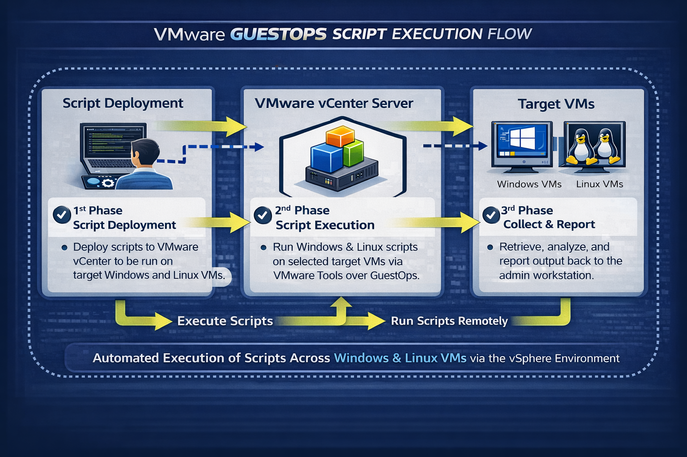

# VMware-GuestOPs-RemoteExecute



PowerShell toolkit for executing scripts remotely across multiple **Windows and Linux VMs** from a single admin workstation through **VMware vSphere Guest Operations** and **VMware Tools**.

The toolkit is designed for mixed fleets. You can define different payloads for Windows and Linux guests, run them across a VM list from a CSV file, capture per-VM results, and then generate an interactive HTML report.

## What this repository contains

All files are stored in the repository root:

- **Invoke-GuestOpsScriptFleet_.ps1**  
  Main fleet runner. Connects to vCenter, detects guest OS, stages the payload inside each guest, executes it with `Invoke-VMScript`, and writes summary and per-VM output files.

- **Generate-GuestOpHTMLReport.ps1**  
  Builds an interactive HTML report from the summary JSON and per-VM output files.

- **Save-GuestOpsAltCredential.ps1**  
  Saves guest OS credentials to a DPAPI-protected CLIXML file so you do not need to store passwords in plaintext in the CSV.

- **targets.csv**  
  Example target list for a mixed Windows/Linux fleet.

- **Example-PS-targetscript.ps1**  
  Example Windows payload.

- **Example-Bash-targetScript.sh**  
  Example Linux payload.

- **Example-GuestOpsReport.html**  
  Example generated HTML report.

- **GuestOPS.png**  
  Repository artwork / cover image.

## Key features

- Execute payloads across multiple VMs from one admin workstation
- Works with both **Windows** and **Linux** guests
- Uses **vSphere Guest Operations** via **VMware Tools**
- Supports **different payloads per guest OS**
- Supports **PowerShell**, **batch**, **bash**, and **custom interpreter** modes
- Supports:
  - OS-specific default credential files
  - one shared credential file
  - per-VM override credential files
  - plaintext CSV credentials if required
- Writes:
  - fleet summary CSV
  - fleet summary JSON
  - one detailed log per VM
  - one raw output text file per VM
- Generates a dynamic HTML report with:
  - VM status summary
  - filtering
  - per-VM detail view
  - syntax-highlighted output display

## Requirements

- PowerShell 7+
- VMware PowerCLI
- Network connectivity from the admin workstation to vCenter
- VMware Tools running inside each target VM
- Valid guest credentials for each target VM
- Guest Operations permissions in vCenter

## How it works

1. Read the target VM list from `targets.csv`
2. Connect to the specified vCenter
3. Detect whether each VM is Windows or Linux
4. Select the correct payload for that guest OS
5. Resolve credentials using:
   1. `AltCredFile` from the CSV row
   2. OS-specific default credential files
   3. one shared credential file
   4. `GuestUser` / `GuestPassword` from the CSV
6. Stage the payload inside the guest
7. Execute it through `Invoke-VMScript`
8. Save per-VM logs and raw output
9. Generate fleet summary CSV / JSON
10. Build the HTML report

## Supported execution modes

### Windows guests
- `PowerShell`
- `Bat`
- `Custom`

### Linux guests
- `Bash`
- `Custom`

### Custom mode
Use a custom execution command template when the guest already has the required interpreter installed.

Examples:

```powershell
-LinuxScriptLanguage Custom -LinuxExecutionCommandTemplate 'python3 {ScriptPath}'
-WindowsScriptLanguage Custom -WindowsExecutionCommandTemplate 'pwsh -File {ScriptPath}'
```

## CSV format

Typical CSV columns:

```csv
VMName,GuestUser,GuestPassword,TargetOs,UseSudo,AltCredFile
TargetWinVM01,,,auto,,
TargetLinVM02,,,auto,,
TargetWinVM03,,,auto,,domainCreds.xml
Ubuntu-01,,,auto,,Ubcreds.xml
WinXP-01,user1,P@ssw0rd123,auto,,
Proton01,root,B@dPa$$,auto,,
```

### Column notes

- **VMName**  
  VM name as seen in vCenter.

- **GuestUser / GuestPassword**  
  Optional plaintext credentials. Useful for quick testing, but less secure.

- **TargetOs**  
  `Auto`, `Windows`, or `Linux`.  
  `Auto` is usually preferred.

- **UseSudo**  
  Reserved column included for CSV compatibility.  
  Keep it in the file if you want a consistent format across tooling.

- **AltCredFile**  
  Optional per-VM CLIXML credential file created with `Save-GuestOpsAltCredential.ps1`.

## Save guest credentials securely

Create a DPAPI-protected credential file:

```powershell
.\Save-GuestOpsAltCredential.ps1 -Path .\WindowsGuestCred.xml
.\Save-GuestOpsAltCredential.ps1 -Path .\LinuxGuestCred.xml
.\Save-GuestOpsAltCredential.ps1 -Path .\Ubuntu-01.xml
```

These files are protected for the current Windows user on the current machine.

## Quick start

### 1. Install PowerCLI

```powershell
Install-Module VMware.PowerCLI -Scope CurrentUser
```

### 2. Prepare your target list

Edit `targets.csv` to match your VM names and credential method.

### 3. Prepare payloads

Windows example:

```powershell
Get-Process
```

Linux example:

```bash
apt list --installed
```

### 4. Run the fleet script

```powershell
$vcPw = Read-Host "Enter vCenter password" -AsSecureString

.\Invoke-GuestOpsScriptFleet_.ps1 `
  -vCenterServer 'vcenter01.domain.local' `
  -TargetsCsv '.\targets.csv' `
  -WindowsScriptPath '.\Example-PS-targetscript.ps1' `
  -WindowsScriptLanguage PowerShell `
  -LinuxScriptPath '.\Example-Bash-targetScript.sh' `
  -LinuxScriptLanguage Bash `
  -WindowsCredentialFile '.\WindowsGuestCred.xml' `
  -LinuxCredentialFile '.\LinuxGuestCred.xml' `
  -vCenterUser 'administrator@vsphere.local' `
  -vCenterPassword $vcPw
```

## Alternative usage examples

### Prompt for guest credentials interactively

```powershell
$vcPw = Read-Host "Enter vCenter password" -AsSecureString

.\Invoke-GuestOpsScriptFleet_.ps1 `
  -vCenterServer 'vcenter01.domain.local' `
  -TargetsCsv '.\targets.csv' `
  -WindowsScriptPath '.\Example-PS-targetscript.ps1' `
  -LinuxScriptPath '.\Example-Bash-targetScript.sh' `
  -PromptForWindowsCredential `
  -PromptForLinuxCredential `
  -vCenterUser 'administrator@vsphere.local' `
  -vCenterPassword $vcPw
```

### Use one shared payload as a fallback

```powershell
$vcPw = Read-Host "Enter vCenter password" -AsSecureString

.\Invoke-GuestOpsScriptFleet_.ps1 `
  -vCenterServer 'vcenter01.domain.local' `
  -TargetsCsv '.\targets.csv' `
  -ScriptPath '.\Example-PS-targetscript.ps1' `
  -vCenterUser 'administrator@vsphere.local' `
  -vCenterPassword $vcPw
```

### Run a Python payload on Linux guests

```powershell
$vcPw = Read-Host "Enter vCenter password" -AsSecureString

.\Invoke-GuestOpsScriptFleet_.ps1 `
  -vCenterServer 'vcenter01.domain.local' `
  -TargetsCsv '.\targets.csv' `
  -LinuxScriptPath '.\collect_info.py' `
  -LinuxScriptLanguage Custom `
  -LinuxExecutionCommandTemplate 'python3 {ScriptPath}' `
  -LinuxCredentialFile '.\LinuxGuestCred.xml' `
  -vCenterUser 'administrator@vsphere.local' `
  -vCenterPassword $vcPw
```

## Output files

After a run, the toolkit writes:

- `GuestOpsScriptFleetSummary-<timestamp>.csv`
- `GuestOpsScriptFleetSummary-<timestamp>.json`
- `<VMName>.log`
- `<VMName>.output.txt`

### Output file purpose

- **Summary CSV / JSON**  
  High-level execution summary for the fleet

- **`.log`**  
  Full per-VM execution detail, including payload metadata and execution context

- **`.output.txt`**  
  Raw output returned from the payload execution for that VM

## Generate the HTML report

```powershell
.\Generate-GuestOpHTMLReport.ps1 `
  -SummaryJsonPath '.\GuestOpsScriptFleetSummary-20260328-120000.json'
```

Optional output path and custom title:

```powershell
.\Generate-GuestOpHTMLReport.ps1 `
  -SummaryJsonPath '.\GuestOpsScriptFleetSummary-20260328-120000.json' `
  -HtmlOutPath '.\GuestOpsScriptFleetReport-20260328-120000.html' `
  -Title 'Remote Script Execution Fleet Report' `
  -Subtitle 'Interactive summary for Windows and Linux GuestOps payload execution.'
```

## HTML report highlights

The generated report provides:

- hero summary with VM status distribution
- status cards
- filterable VM list
- all-VM overview
- single-VM detail view
- links to log and output files
- syntax-highlighted raw guest output

An example output file is included in this repository:

- `Example-GuestOpsReport.html`

## Security notes

- The safest routine is to use:
  - `WindowsCredentialFile`
  - `LinuxCredentialFile`
  - `AltCredFile`
- Plaintext passwords in `targets.csv` are supported for convenience, but should be avoided for production use.
- DPAPI-protected CLIXML credential files are tied to the current Windows user and machine.

## Notes and limitations

- Linux guest staging uses a base64 here-document and therefore expects a `base64` utility in the target guest.
- `Custom` mode assumes the required interpreter already exists in the guest.
- VMware Tools must be running and healthy in the guest for execution to work.
- Guest Operations permissions are required in vCenter.
- The current runner file is named **`Invoke-GuestOpsScriptFleet_.ps1`** in this repository.  
  If you prefer, you can rename it later to a cleaner production filename before publishing.

## Example repository layout

```text
vmware-guestops-script-runner/
├── GuestOPS.png
├── Invoke-GuestOpsScriptFleet_.ps1
├── Generate-GuestOpHTMLReport.ps1
├── Save-GuestOpsAltCredential.ps1
├── targets.csv
├── Example-PS-targetscript.ps1
├── Example-Bash-targetScript.sh
└── Example-GuestOpsReport.html
```

## Suggested future enhancements

- optional `sudo` handling for Linux guests
- automatic HTML report generation at the end of each fleet run
- packaged release ZIP
- GitHub Actions linting / validation
- additional example payloads

## License

Released under the MIT License. See [`LICENSE`](LICENSE).

## Author notes

This repository was built to provide a practical VMware Guest Operations based remote execution toolkit with a consistent reporting style across your recent admin toolsets.
